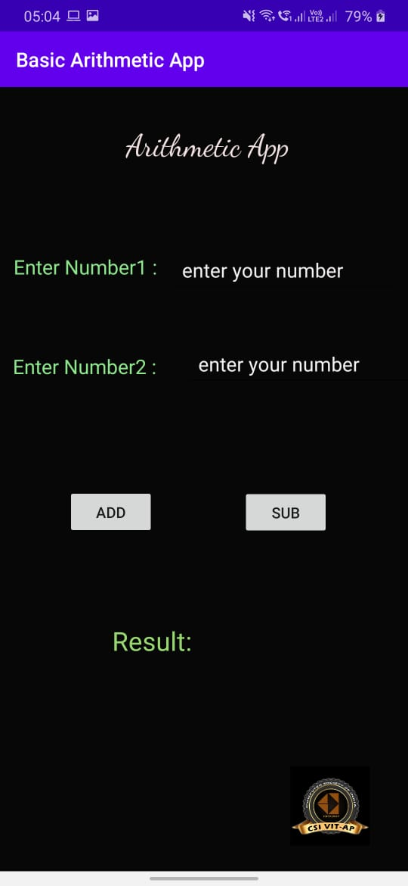
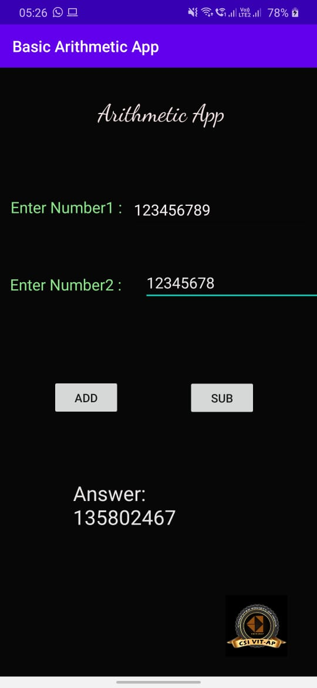
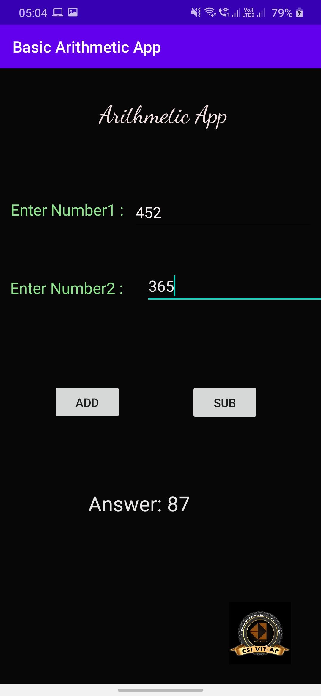

# BasicArithmeticApp
Here it's a Basic Arithmetic App where students can learn basic concepts of Adroid Studios, JAVA , .xml and working with it. 
I have used simple logics so that students can understand the concepts and learn the things in an easy way.

# The Main page:

# Addition page solution:

# Subtraction page solution:

## Apache-2.0 License

Copyright (c) 2020 SrujanCheemakurthi

## Apache-2.0 License
Copyright (c) 2020 SrujanCheemakurthi
A permissive license whose main conditions require preservation of copyright and license notices. Contributors provide an express grant of patent rights. Licensed works, modifications, and larger works may be distributed under different terms and without source code.
